# DevTools Training Assignment & Hands-On Practice

---

## Assignment Overview

### Primary Objectives:
- Study and experiment with advanced development tools  
- Install and configure additional tools and extensions  
- Document your learning and create practical examples  
- Prepare for real-world development scenarios  

---

## Specific Tasks to Complete

---

## Task 1: VS Code

### What to Do:
- Install all essential extensions mentioned in the documentation  
- Practice using keyboard shortcuts  
- Set up the Live Server extension and test it  

### Deliverables:

#### Screenshot of Your VS Code with All Extensions Installed  
Below is a screenshot showing all the required extensions installed in VS Code:  
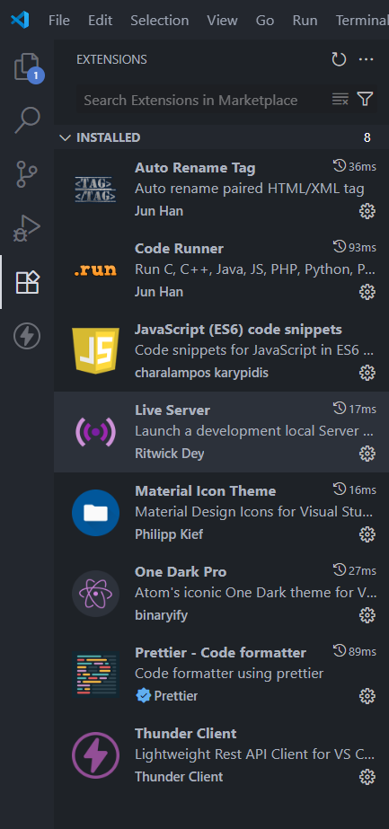

#### List of Shortcuts You've Learned with Their Functions

1. `Ctrl + P` – Quick file navigation  
2. `Ctrl + Shift + P` – Open Command Palette  
3. `Alt + Click` – Multi-cursor editing  
4. `Ctrl + /` – Comment/Uncomment line  
5. `F5` – Run script  
6. `F8` – Jump to next error/warning  
7. `Ctrl + ~` – Open Terminal  
8. `Ctrl + Shift + E` – Open Explorer panel  
9. `Ctrl + Shift + X` – Open Extensions panel  
10. `Ctrl + Shift + F` – Search across files  

---

## Task 2: Database Setup & Operations

### What to Do:
- Install SQL Server  
- Install SQL Server Management Studio (SSMS)  
- Create a sample database using the provided SQL scripts  
- Execute queries and explore SSMS  

### Deliverables:

#### Screenshot of Successful Database Creation  
The following screenshot confirms successful database creation:  
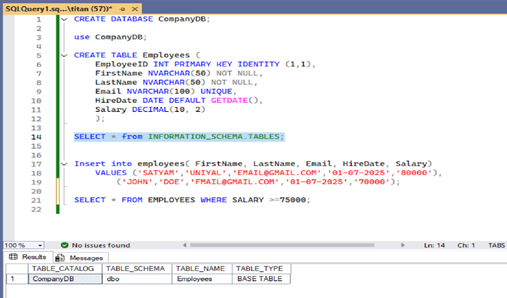

#### Results of Running the Sample Queries  
Queries were executed successfully as shown below:  
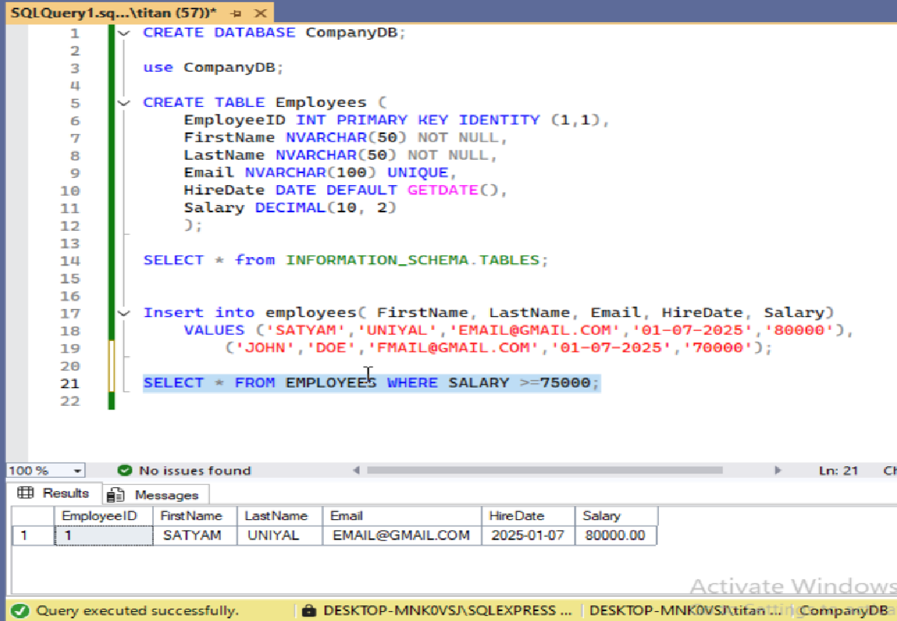

#### Summary of SSMS Features Explored

1. User-friendly interface to manage SQL Server instances, databases, and queries  
2. Object Explorer for navigating tables, views, and functions  
3. Built-in database backup and restore capabilities  
4. Import/Export wizard for smooth data transfer  
5. Template Explorer for reusable T-SQL templates  
6. Activity Monitor for performance tracking and lock analysis  

---

## Task 3: Version Control with GitHub Desktop

### What to Do:
- Create a GitHub account  
- Set up a new repository  
- Practice basic Git operations (commit, push, pull)  

### Deliverables:

#### GitHub Repository Link  
Here is the link to the GitHub repository containing all practice files:  
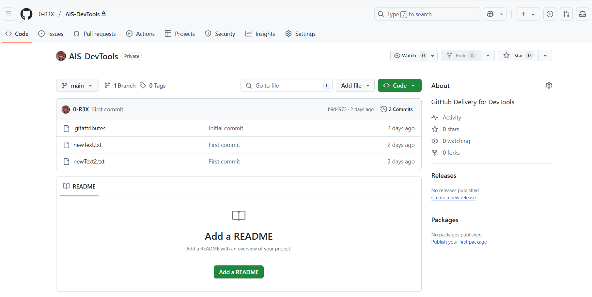  
[GitHub Repo: AIS-DevTools](https://github.com/0-R3X/AIS-DevTools)

#### Screenshots of Successful Commits and Pushes  
Below are screenshots demonstrating successful commits and push operations:  
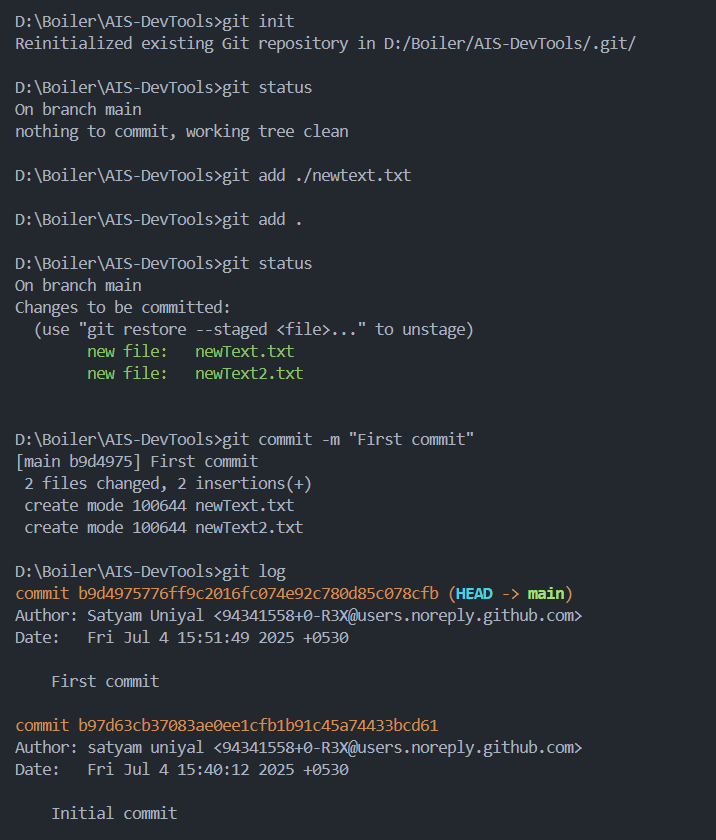  
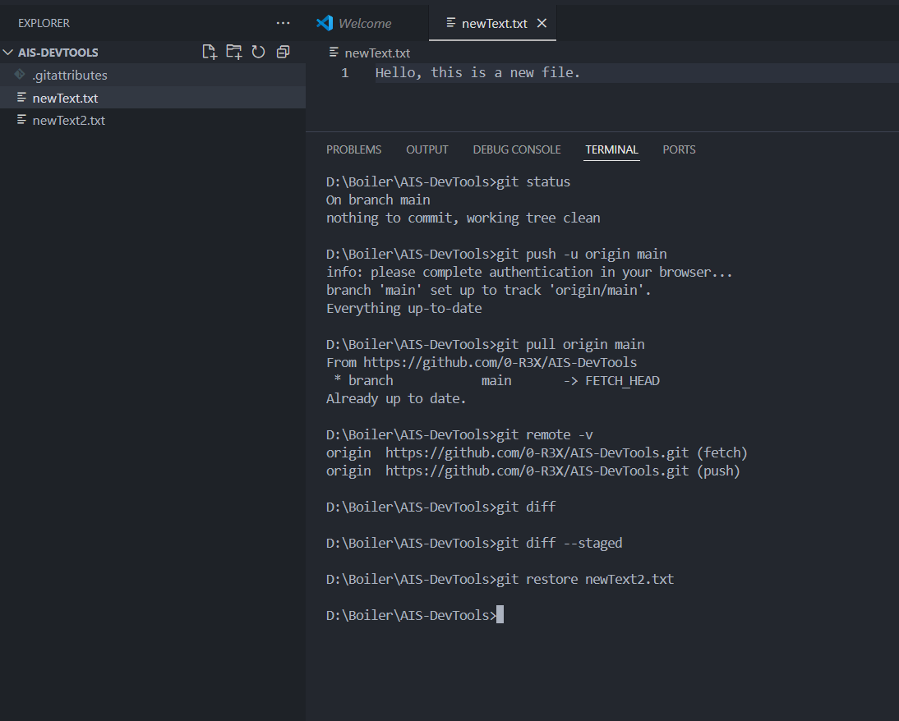

#### Documentation of Git Workflow Followed

1. **Initialized Repository** – Created a new repository using GitHub Desktop  
2. **Made Changes** – Added `newText.txt` and `newText2.txt` for version control testing  
3. **Committed Changes** – Wrote descriptive commit messages  
4. **Pushed to GitHub** – Uploaded local changes to the remote repository  
5. **Pulled Changes** – Synced local repository with remote updates  
6. **Restored Changes** – Recovered a deleted file using version control history  

---

## Task 4: Node.js Ecosystem Setup

### What to Do:
- Install Node.js and NVM  
- Practice using NPM commands  
- Install Nodemon  

### Deliverables:

#### Screenshots Showing Successful Installations  
The following screenshots confirm proper setup and usage of Node.js and NPX:  
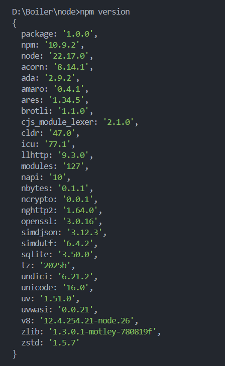  
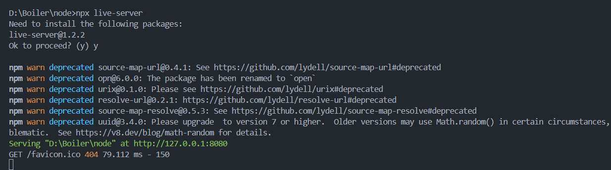

#### Documentation of NPM Commands Practiced

1. `npm start` – Start a package  
2. `npm run` – Run arbitrary scripts  
3. `npm run build` – Build script (if defined)  
4. `npm help` – View npm help documentation  
5. `npm init` – Generate `package.json`  
6. `npm explain` – Explain installed packages  
7. `npm install / uninstall` – Add or remove a package  
8. `npm star / unstar` – Favorite or unfavorite a package  
9. `npm stars` – Display all starred packages  
10. `npm version` – Display current npm version  

---

## Task 5: Technical Documentation

### What to Do:
- Use Draw.io to create two diagrams  
- Write a summary of your learning experience  
- List challenges and describe how you resolved them  

### Deliverables:

#### Diagrams Created in Draw.io  
The diagrams below illustrate development workflows and system structure:  
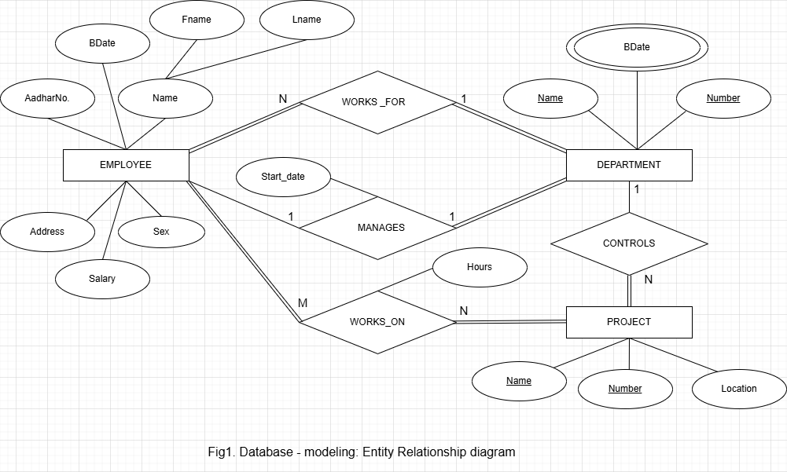  
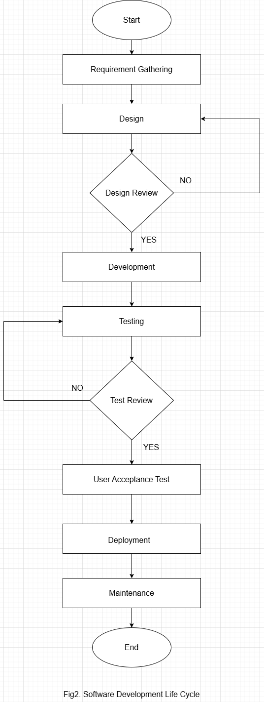

#### Summary of Learning Experience

During this training, I installed and configured several essential tools for modern development including **Visual Studio**, **VS Code**, **Git**, **GitHub**, **Microsoft SQL Server 2022**, **Anaconda**, and **Draw.io**.  

Each setup introduced a different part of the development ecosystem—such as version control, backend development, and database management. This hands-on experience helped me understand how these tools work together in real-world development scenarios. I also learned how to configure a development-ready environment using *VirtualBox* and how to resolve technical issues effectively.

#### List of Challenges and How You Solved Them

1. **SQL Server Installation Failure**  
   - **Problem:** Installation failed with the message "Wait on the Database Engine recovery handle failed"  
   - **Solution:** Tried multiple fixes including using the Developer Edition, changing the installation drive, switching to version 2019, and ultimately succeeded by installing SQL Server 2022 inside a virtual machine using Oracle VirtualBox  

2. **PowerShell Script Restrictions (`npm.ps1` error)**  
   - **Problem:** Unable to run npm commands due to PowerShell execution policy restrictions  
   - **Solution:** Switched to **Command Prompt (CMD)** to successfully run npm commands and install packages without restriction  

---
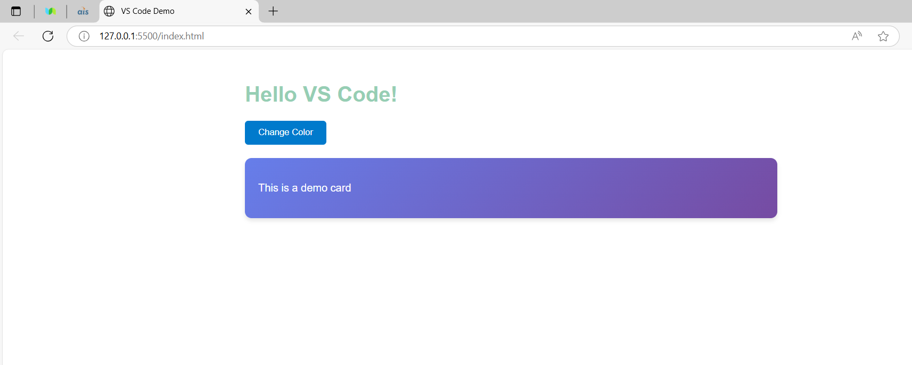