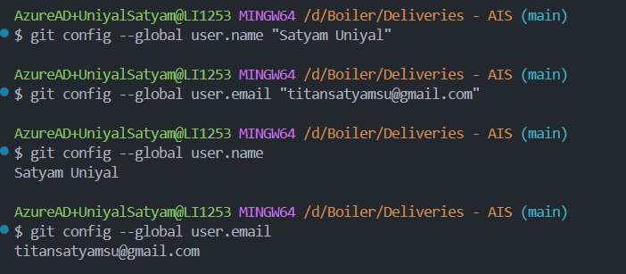
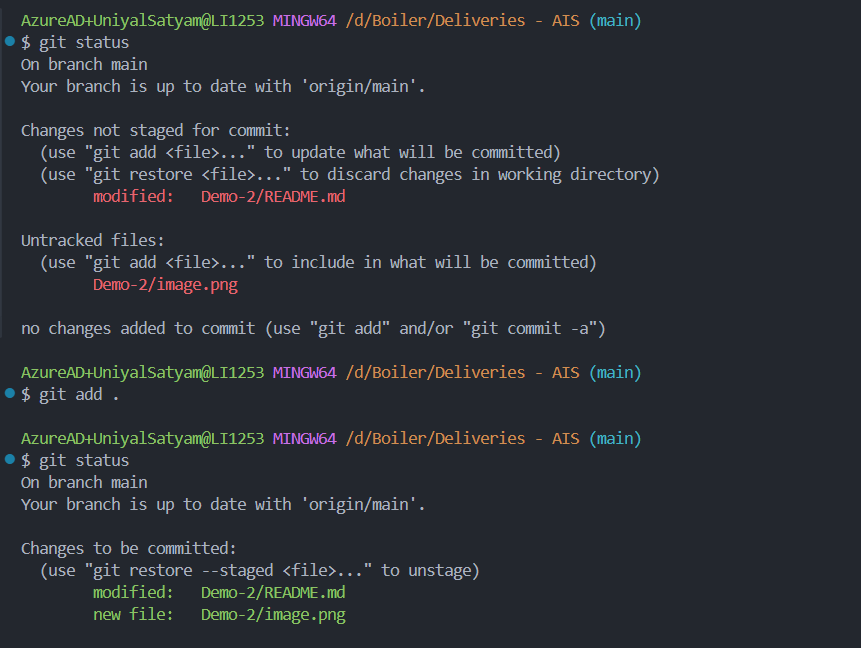
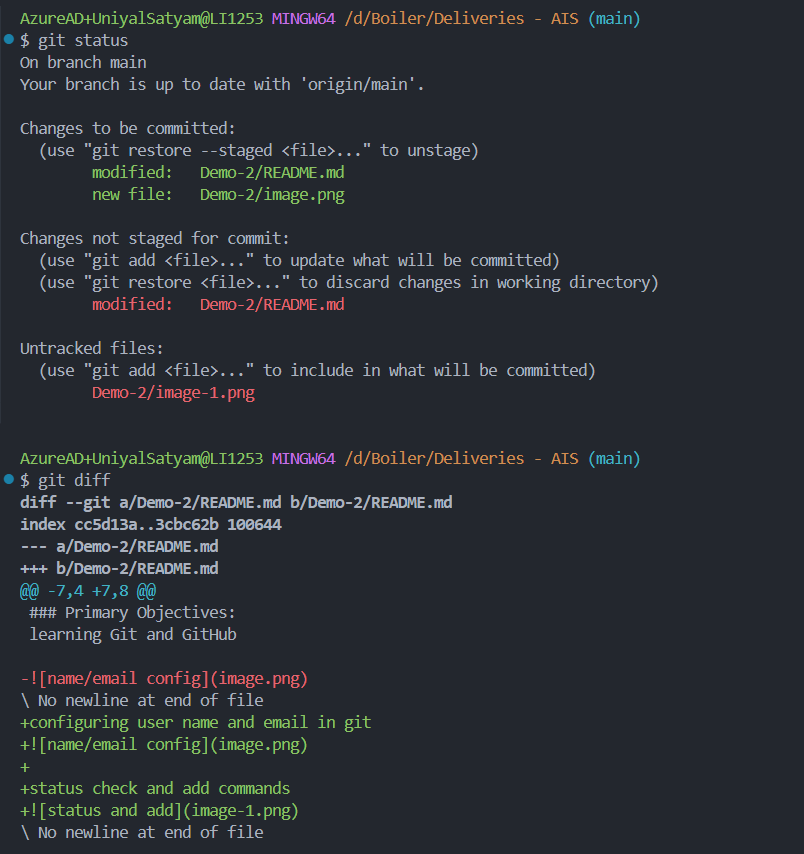
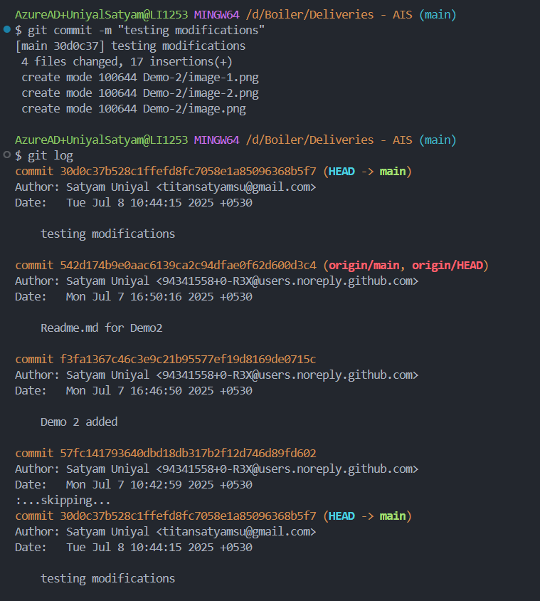
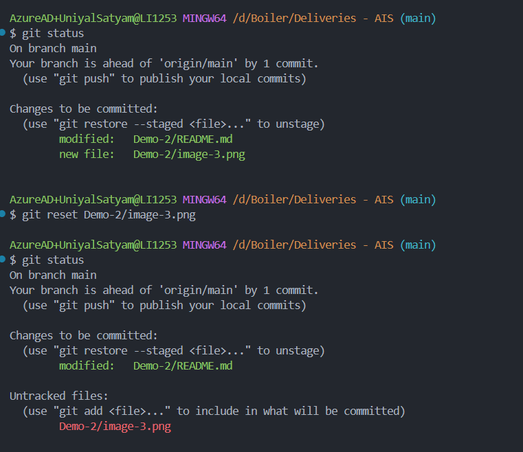
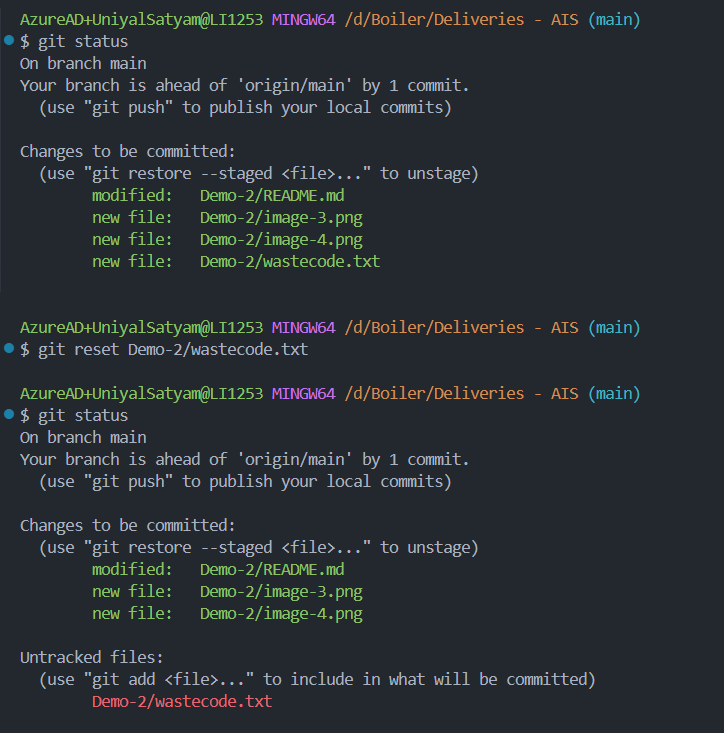
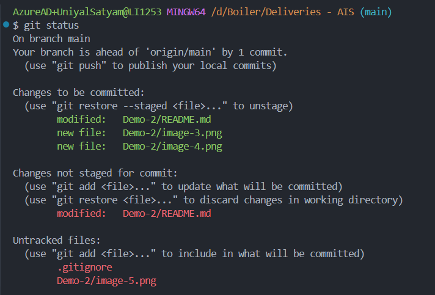
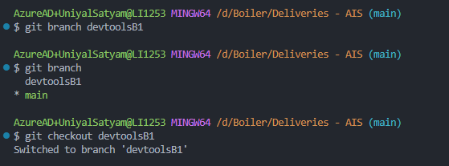

# Session 1 - DevTools 

---

## Assignment Overview

### Primary Objectives:
learning Git and GitHub

- configuring user name and email in git
    

- tatus check and add commands
    

- checking differences
    

- commiting and logging
    

- reseting/ removing from staging area
    
    

- .gitignore
    

- branching
    